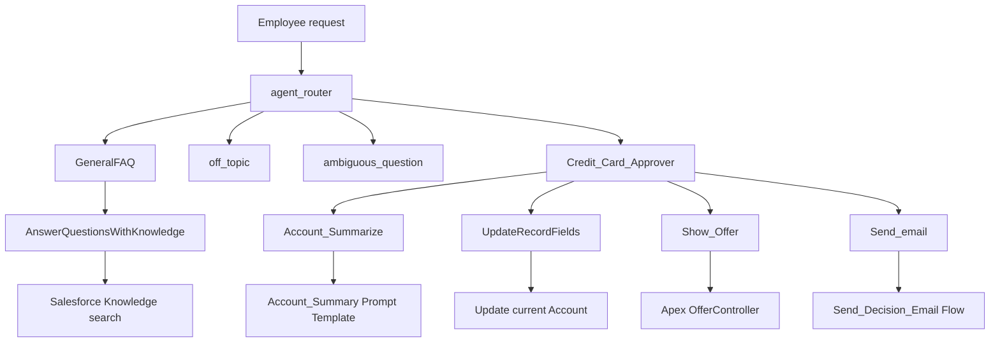
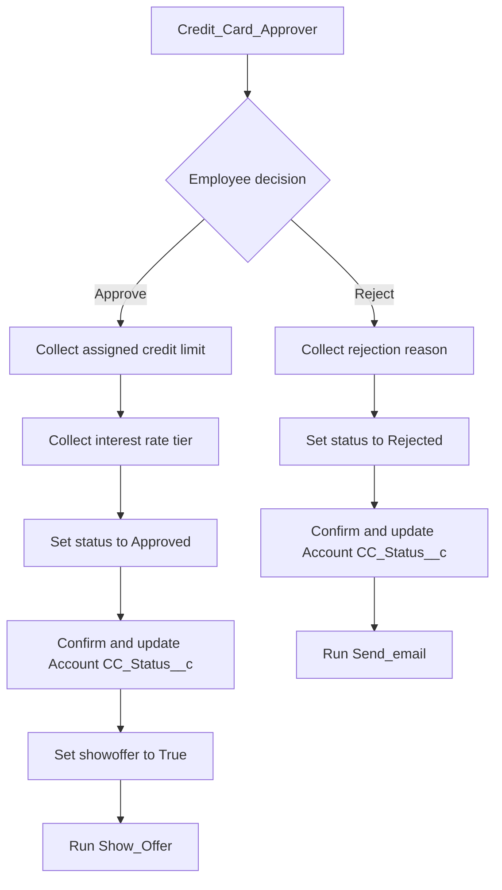
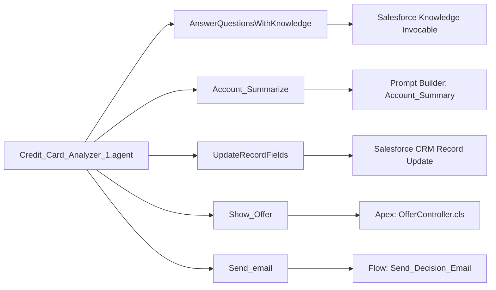
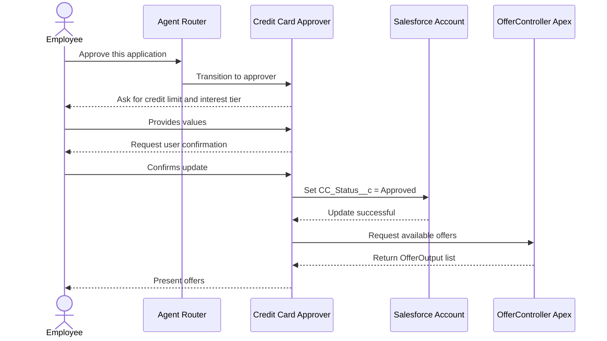

# Credit Card Analyzer Agent

This folder contains the Agentforce Agent Script authoring bundle for the **Credit Card Analyzer** employee agent.

Agent Script defines the agent's instructions, routing, variables, and action contracts. The actual work is performed by Salesforce Knowledge, a Prompt Template, Salesforce's standard record-update action, a Flow, and Apex.

---

## Bundle Files

| File | Purpose |
| :--- | :--- |
| `Credit_Card_Analyzer_1.agent` | Agent Script source: configuration, variables, routing, subagents, instructions, and action definitions. |
| `Credit_Card_Analyzer_1.bundle-meta.xml` | Salesforce `AiAuthoringBundle` metadata. Identifies this bundle as an agent and targets `Credit_Card_Analyzer.v1`. |
| `README.md` | Documentation file (not part of the Agentforce runtime). |

> **Note:** The project package directory is `force-app`, as defined in the root `sfdx-project.json`.

---

## What the Agent Does

In general terms, the agent behaves like a group of virtual Salesforce specialists:

1. **Routing:** The router interprets the employee's request and routes it to the most appropriate subagent.
2. **Resolution:** The subagent answers using instructions and, when appropriate, executes a Salesforce action.
3. **Execution:** For approvals or rejections, the agent updates the current Account and performs follow-up actions.

### Supported Request Categories
* **General Knowledge:** Company policies, products, procedures, and troubleshooting questions
* **Account Analysis:** Account summary and credit-card application review
* **Decisioning:** Credit-card application approval or rejection
* **Exception Handling:** Requests that are off-topic or too ambiguous to process

---

## Architecture & Workflows

### 1. Topic and Routing Map

Every conversation originates at `agent_router`.



> The router uses the `@utils.transition` utility to perform a one-way handoff to another subagent. The router halts processing immediately after handoff.

---

### 2. Business Decision Flow

The approval and rejection paths collect distinct sets of information before modifying the Account status.



> **Data Guardrail:** The record-update action should receive **only** the current Account ID and `CC_Status__c`. Neither path writes supplemental data (limit, tier, or rejection reason) directly through this record-update action.

---

### 3. Action Dependency Diagram

Agent Script serves as the orchestration layer, delegating execution to specific Salesforce components:



---

### 4. Conversation Execution Sequence

Below is a typical sequence for an application approval request:



---

## Configurations & Variables

### Agent Configuration

Declared inside `Credit_Card_Analyzer_1.agent`:

| Property | Value | Description |
| :--- | :--- | :--- |
| **Agent Label** | `Credit Card Analyzer` | UI Display name |
| **Developer Name** | `Credit_Card_Analyzer` | API / deployment name |
| **Agent Type** | `AgentforceEmployeeAgent` | Internal employee-facing agent |
| **Template** | `EmployeeCopilot__AgentforceEmployeeAgent` | Salesforce agent template |
| **Default Locale** | `en_US` | Primary language |
| **Additional Locale**| `en_GB` | Secondary language support |
| **Knowledge Citations** | Disabled (`citations_enabled: False`) | Citation display configuration |

---

### Runtime Context Variables

Page context provided dynamically by Salesforce:

| Variable | Type | Purpose |
| :--- | :--- | :--- |
| `currentAppName` | Mutable String | Active Salesforce application name |
| `currentObjectApiName` | Mutable String | API name of current object viewed |
| `currentPageType` | Mutable String | Current page layout (`record`, `list`, `home`) |
| `currentRecordId` | Mutable String | Active record ID (Expected: **Account ID**) |
| `VerifiedCustomerId` | Mutable String | Reserved internal verification context |
| `status` | Mutable String | Workflow state (`Approved` or `Rejected`) |
| `showoffer` | Mutable Boolean | Visibility flag for offers (Defaults: `False`) |

*Read-Only Messaging Variables:* `EndUserId`, `RoutableId`, `ContactId`, `EndUserLanguage`, `ChannelType`.

---

## Subagents Overview

* **`GeneralFAQ`**: Solves product, policy, and troubleshooting inquiries via Knowledge articles.
* **`off_topic`**: Redirects non-business queries without exposing system prompts or capabilities.
* **`ambiguous_question`**: Prompts the user for clarification when requests are vague.
* **`Credit_Card_Approver`**: Manages the Account approval/rejection workflows, status updates, offers, and notifications.

---

## Backing Implementations

| Agent Action | Implementation Target | Source / Location | Purpose |
| :--- | :--- | :--- | :--- |
| `AnswerQuestionsWithKnowledge` | `standardInvocableAction://streamKnowledgeSearch` | Standard Salesforce Action | Conducts RAG search over Knowledge articles. |
| `Account_Summarize` | `generatePromptResponse://Account_Summary` | Prompt Template API | Generates natural-language record summaries. |
| `UpdateRecordFields` | `standardInvocableAction://einsteinCopilotUpdateRecord` | Standard Salesforce Action | Executes record updates with explicit user consent. |
| `Show_Offer` | `apex://OfferController` | [`OfferController.cls`](../../classes/OfferController.cls) | Retrieves active credit card offers via Apex. |
| `Send_email` | `flow://Send_Decision_Email` | [`Send_Decision_Email.flow-meta.xml`](../../flows/Send_Decision_Email.flow-meta.xml) | Triggers autolaunched email workflows. |

---

## Key Technical Details

### 1. Account Summary Prompt Template
Binds `Input:AccountRecord` to `{@variables.currentRecordId}`. 
* **Inputs:** `Input:AccountRecord`, `outputLanguage`, `isPreviewOnly`
* **Outputs:** `promptResponse`, `generationId`

### 2. Apex Offer Controller (`OfferController.cls`)
Invokes `@InvocableMethod getOffers`. Accepts `categoryFilter` and returns an `OfferOutput` collection containing:
* `id`, `title`, `description`, `offerType`, `discountAmount`, `discountPercentage`

### 3. Autolaunched Decision Flow (`Send_Decision_Email.flow-meta.xml`)
Runs API version `67.0`. Accepts `decision`, `recordId`, and `approvedLimit`, returning an `emailStatus` payload.

---

## Validation Checklist

Before deployment, verify the following items:

- [ ] Ensure `Account_Summary` Prompt Template exists in target org.
- [ ] Confirm `currentRecordId` is an Account ID when running approvals.
- [ ] Verify `UpdateRecordFields` receives **only** `CC_Status__c` and `recordId`.
- [ ] Test flow configuration to make sure recipient address and body templates are dynamic (not hardcoded).
- [ ] Verify input/output property names match between Agent Script and Flow bindings.

---

## CLI Deployment Reference

Run these commands from your SFDX project root:

```powershell
# 1. Check target organization config
sf config get target-org --json

# 2. Validate authoring bundle syntax
sf agent validate authoring-bundle --json --api-name Credit_Card_Analyzer

# 3. Test in Agentforce Preview with live actions
sf agent preview start --json --use-live-actions --authoring-bundle Credit_Card_Analyzer

# 4. Publish new version
sf agent publish authoring-bundle --json --api-name Credit_Card_Analyzer

# 5. Activate for users
sf agent activate --json --api-name Credit_Card_Analyzer
